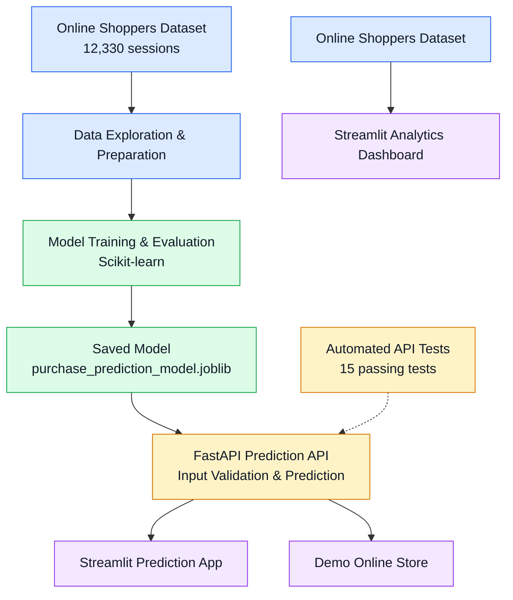

# ShopSmart — System Architecture

This diagram illustrates the data preparation and model-training workflow, followed by the prediction-serving architecture.

```mermaid
flowchart TD
    A["Online Shoppers Dataset<br/>12,330 sessions"] --> B["Data Exploration & Preparation"]
    B --> C["Model Training & Evaluation<br/>Scikit-learn"]
    C --> D["Saved Model<br/>purchase_prediction_model.joblib"]

    D --> E["FastAPI Prediction API<br/>Input Validation & Prediction"]

    E --> F["Streamlit Prediction App"]
    E --> G["Demo Online Store"]

    H["Online Shoppers Dataset"] --> I["Streamlit Analytics Dashboard"]
    
    J["Automated API Tests<br/>15 passing tests"] -.-> E

    classDef data fill:#dbeafe,stroke:#2563eb,color:#111827
    classDef model fill:#dcfce7,stroke:#16a34a,color:#111827
    classDef api fill:#fef3c7,stroke:#d97706,color:#111827
    classDef ui fill:#f3e8ff,stroke:#9333ea,color:#111827

    class A,B,H data
    class C,D model
    class E,J api
    class F,G,I ui
```
